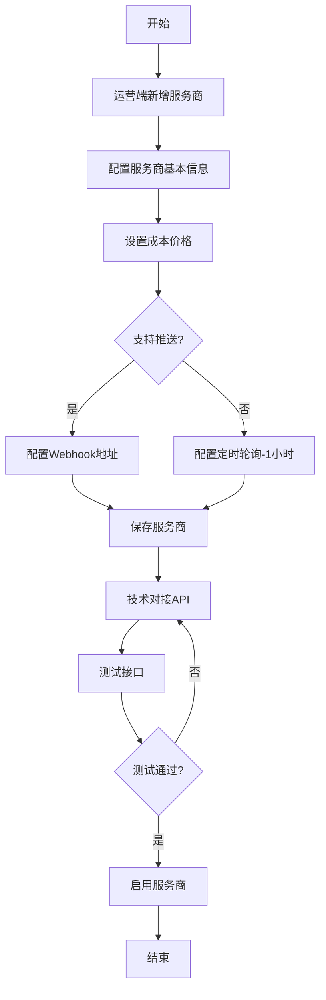
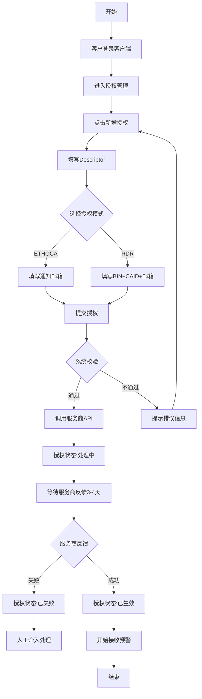
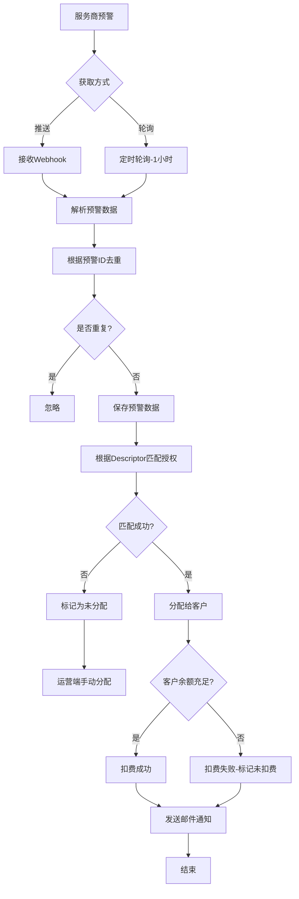
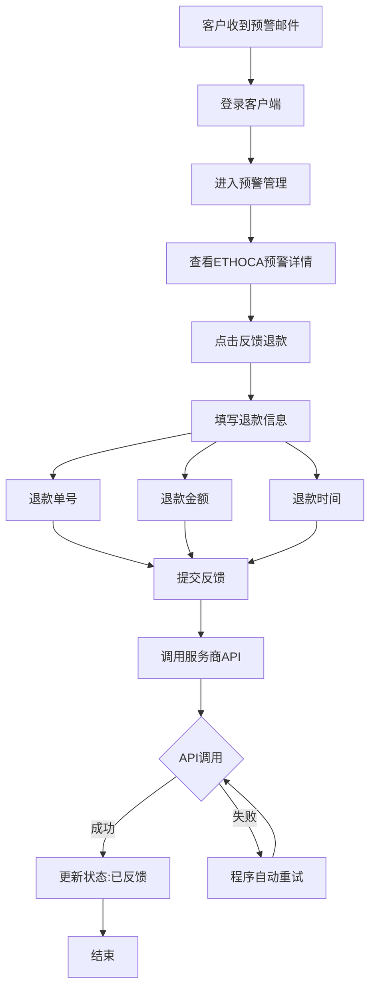
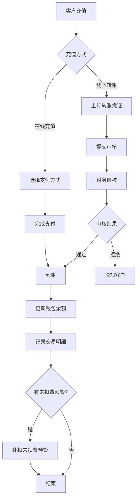
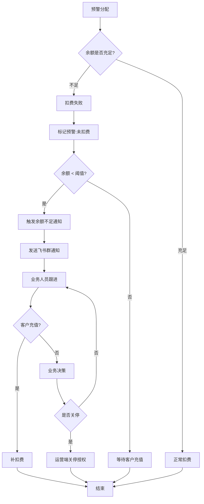
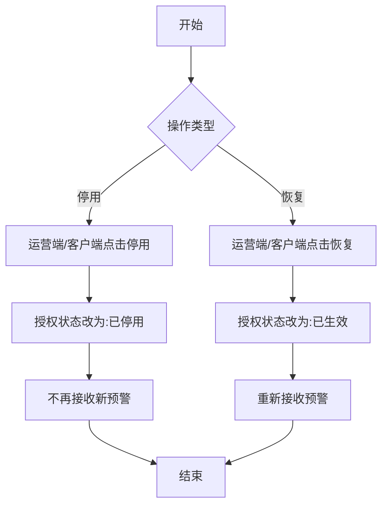

# 拒付预警系统 - 业务流程设计

## 文档说明
本文档详细描述拒付预警系统的所有核心业务流程，包括流程图和文字说明。

---

## 1. 服务商对接流程

### 1.1 流程图



### 1.2 流程说明

**步骤1: 新增服务商**
- 运营人员在运营端点击"新增服务商"
- 填写服务商基本信息（名称、联系方式等）

**步骤2: 配置价格**
- 选择定价模式：固定价格 或 阶梯价格
- 设置ETHOCA和RDR的成本价格

**步骤3: 配置API**
- 推送模式：系统提供Webhook URL和验证Token
- 轮询模式：填写服务商API地址和认证信息

**步骤4: 测试连接**
- 测试授权接口
- 测试查询接口（轮询模式）
- 测试反馈接口（ETHOCA模式）

**步骤5: 启用服务商**
- 测试通过后启用服务商
- 开始接收预警数据

---

## 2. 客户授权流程

### 2.1 流程图



### 2.2 授权状态说明

| 状态 | 说明 | 颜色标识 | 可执行操作 |
|------|------|----------|------------|
| Processing | 已提交至服务商,等待审核(3-4天) | 黄色 | 无 |
| Active | 服务商审核通过,可接收预警 | 绿色 | 停用、编辑邮箱、删除 |
| Failed | 服务商审核失败,需重新授权 | 红色 | 删除、重新提交 |
| Disabled | 主动停用,不接收预警 | 灰色 | 恢复、删除 |

### 2.3 校验规则

**Descriptor校验:**
- 不能为空
- 格式：字母、数字、特殊字符组合
- 同一Descriptor不能在同一服务商重复授权

**BIN校验（RDR模式）:**
- 必填
- 必须是6位数字

**CAID校验（RDR模式）:**
- 必填
- 字母数字组合

**邮箱校验:**
- 必填
- 必须是有效的邮箱格式
- 可以重复使用

---

## 3. 预警接收与分配流程

### 3.1 流程图



### 3.2 匹配逻辑

**步骤1: Descriptor匹配**
- 从预警数据中提取Descriptor
- 在授权表中查找匹配的记录
- 匹配条件：
  - Descriptor完全一致
  - 授权状态为"已生效"(Active)
  - 授权模式包含预警类型（ETHOCA或RDR）

**步骤2: 未匹配处理**
- 如果未找到匹配的授权，标记为"未分配"
- 在运营端预警明细中显示，支持手动分配

### 3.3 扣费逻辑

**扣费时机:**
- 预警分配给客户后立即扣费

**扣费金额计算:**
1. 获取客户的定价配置
2. 如果是阶梯价格，根据当月累计预警量确定单价
3. 根据预警类型（ETHOCA/RDR）确定单价
4. 扣费金额 = 单价

**扣费流程:**
```
1. 检查客户余额是否充足
2. 如果充足：
   - 扣除余额
   - 记录交易明细
   - 更新预警扣费状态为"已扣费"
3. 如果不足：
   - 不扣费
   - 更新预警扣费状态为"未扣费"
   - 检查余额是否低于阈值，触发余额不足通知
```

### 3.4 邮件通知

**触发时机:**
- 预警分配给客户后（无论是否扣费成功）

**通知内容:**
- 预警类型（ETHOCA/RDR）
- Descriptor
- 交易金额
- 交易时间
- 处理说明（ETHOCA需要反馈，RDR无需处理）
- 登录链接

**通知邮箱:**
- 使用授权记录中配置的notification_email

---

## 4. ETHOCA预警处理流程

### 4.1 流程图



### 4.2 反馈字段说明

| 字段名 | 类型 | 必填 | 说明 | 校验规则 |
|--------|------|------|------|----------|
| 退款单号 | String | 是 | 退款交易ID | 不能为空 |
| 退款金额 | Number | 是 | 实际退款金额 | 必须>0，最多2位小数 |
| 退款时间 | DateTime | 是 | 退款处理时间 | 不能是未来时间 |

### 4.3 反馈状态

| 状态 | 说明 | 可执行操作 |
|------|------|------------|
| Pending Feedback | 等待客户提交退款信息 | 提交反馈 |
| Completed | 已提交退款信息至服务商 | 查看详情 |

**注意:**
- 每条ETHOCA预警只能反馈一次
- 反馈后不可修改或撤销
- API调用失败会自动重试，无需人工干预

---

## 5. 客户充值与扣费流程

### 5.1 充值流程图



### 5.2 在线充值流程

**步骤1: 发起充值**
- 客户输入充值金额（最低$10）
- 选择支付方式（信用卡/PayPal/Stripe等）

**步骤2: 支付处理**
- 调用支付网关API创建订单
- 跳转到支付页面
- 客户完成支付

**步骤3: 支付回调**
- 支付网关回调系统
- 验证支付结果
- 更新充值状态

**步骤4: 余额更新**
- 增加客户钱包余额
- 记录交易明细（类型：在线充值）

**步骤5: 补扣费**
- 查询该客户的未扣费预警
- 逐条尝试扣费
- 更新预警扣费状态

### 5.3 线下转账流程

**步骤1: 提交转账**
- 客户填写转账金额
- 选择转账日期
- 上传转账凭证（jpg/png/pdf，最大5MB）
- 填写备注（可选）

**步骤2: 等待审核**
- 状态：Pending Review
- 财务人员在1-2个工作日内审核

**步骤3: 审核处理**
- 审核通过：
  - 状态改为Approved
  - 更新钱包余额
  - 记录交易明细
  - 发送邮件通知客户
  - 触发补扣费流程
- 审核拒绝：
  - 状态改为Rejected
  - 填写拒绝原因
  - 发送邮件通知客户

### 5.4 补扣费逻辑

**触发时机:**
- 客户充值到账后
- 仅处理"未扣费"状态的预警

**执行流程:**
```
1. 查询客户所有"未扣费"状态的预警
2. 按接收时间正序排序
3. 逐条执行扣费：
   - 检查余额是否充足
   - 充足则扣费并更新状态为"已扣费"
   - 不足则跳过，保持"未扣费"状态
4. 记录每次扣费的交易明细
```

---

## 6. 余额不足预警流程

### 6.1 流程图



### 6.2 余额预警规则

**阈值配置:**
- 在客户管理中配置余额预警阈值
- 示例：设置为$1000，当余额低于$1000时触发

**通知方式:**
- 发送飞书群通知
- 通知内容包括：
  - 客户名称
  - 客户ID
  - 当前余额
  - 未扣费预警数量
  - 客户联系方式

**跟进流程:**
1. 业务人员收到通知
2. 联系客户催促充值
3. 如客户拒不充值，业务决策是否关停授权
4. 关停授权后，该客户不再接收新预警

---

## 7. 授权停用与恢复流程

### 7.1 流程图



### 7.2 停用说明

**触发场景:**
1. 客户主动停用（客户端操作）
2. 运营人员停用（运营端操作）
3. 批量关停（客户余额不足且拒不充值）

**停用效果:**
- 授权状态改为"Disabled"
- 不再接收新的预警
- 已有预警仍可查看和处理
- 停用不影响历史数据

**注意事项:**
- 停用操作可逆，可随时恢复
- 停用不等于删除，数据仍保留

### 7.3 恢复说明

**操作方式:**
- 点击"Enable"或"恢复"按钮
- 确认后立即生效

**恢复效果:**
- 授权状态改为"Active"
- 重新开始接收预警
- 不影响停用期间的数据

---

## 8. 数据同步与定时任务

### 8.1 轮询任务

**执行频率:** 每1小时执行一次

**执行内容:**
1. 遍历所有"轮询模式"且"已启用"的服务商
2. 调用服务商查询接口获取最新预警
3. 执行预警接收与分配流程
4. 记录同步日志

**异常处理:**
- API调用失败：记录错误日志，下次继续尝试
- 数据解析失败：记录错误日志，跳过该条数据

### 8.2 补扣费任务

**执行频率:** 每10分钟执行一次

**执行内容:**
1. 查询所有有"未扣费"预警的客户
2. 检查客户余额是否充足
3. 执行补扣费逻辑
4. 更新预警扣费状态

### 8.3 余额监控任务

**执行频率:** 每30分钟执行一次

**执行内容:**
1. 查询所有客户的余额和阈值
2. 筛选余额低于阈值的客户
3. 发送飞书群通知（每个客户每天最多通知1次）
4. 记录通知日志

---

## 9. 异常处理流程

### 9.1 服务商API异常

**异常类型:**
- 网络超时
- 认证失败
- 接口报错
- 返回数据格式错误

**处理方式:**
1. 自动重试（最多3次，间隔1分钟）
2. 记录详细错误日志
3. 如仍失败，发送飞书告警
4. 人工介入处理

### 9.2 预警匹配失败

**场景:** 预警的Descriptor无法匹配到任何授权

**处理方式:**
1. 标记为"未分配"
2. 在运营端预警明细中显示
3. 支持运营人员手动分配
4. 调查原因（可能是客户未授权或授权失败）

### 9.3 扣费失败

**场景:** 客户余额不足

**处理方式:**
1. 标记预警为"未扣费"
2. 预警仍显示给客户
3. 触发余额不足通知
4. 客户充值后自动补扣

### 9.4 邮件发送失败

**处理方式:**
1. 自动重试（最多3次）
2. 记录失败日志
3. 邮件发送失败不影响预警分配

---

## 10. 业务规则总结

### 10.1 核心业务规则

| 规则项 | 规则说明 |
|--------|----------|
| 授权唯一性 | 同一Descriptor不能在同一服务商重复授权 |
| 预警去重 | 根据alert_id去重，同一预警只处理一次 |
| 扣费时机 | 预警分配给客户时立即扣费 |
| 补扣费 | 客户充值后自动补扣未扣费的预警 |
| 反馈限制 | ETHOCA预警只能反馈一次，不可修改 |
| 余额预警 | 余额低于阈值时发送飞书通知 |
| 授权审核 | 服务商审核需3-4天，期间状态为Processing |

### 10.2 计费规则

**固定价格模式:**
- 每条预警固定单价
- ETHOCA和RDR可设置不同价格

**阶梯价格模式:**
- 按月度累计预警量计算单价
- 当月预警量增加时，自动切换到对应阶梯
- 每条预警按当前所在阶梯计费

**示例:**
```
阶梯设置:
- 0-100条: ETHOCA $10, RDR $8
- 101-500条: ETHOCA $9, RDR $7
- 501+条: ETHOCA $8, RDR $6

客户当月预警情况:
- 第1-100条: 按 $10/$8 计费
- 第101条开始: 按 $9/$7 计费
- 第501条开始: 按 $8/$6 计费
```

### 10.3 状态流转规则

**授权状态流转:**
```
创建 → Processing → Active ⇄ Disabled
              ↓
           Failed
```

**预警处理状态流转（ETHOCA）:**
```
Pending Feedback → Completed
```

**扣费状态流转:**
```
Uncharged → Charged
```

---

**文档完成✅**

本文档详细描述了拒付预警系统的所有核心业务流程，包括流程图、状态机、业务规则等。结合其他设计文档，可完整指导系统开发。
